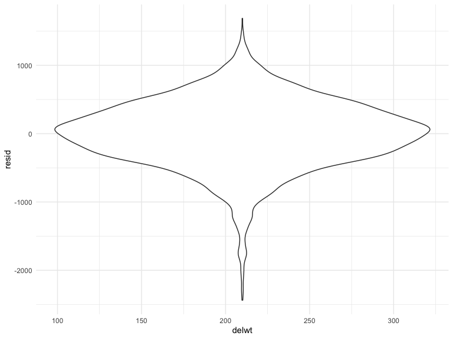
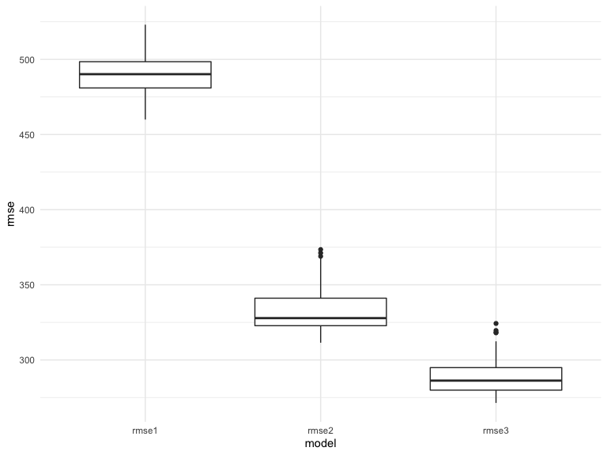
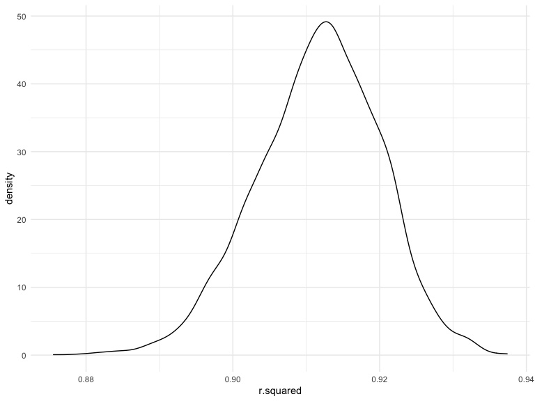
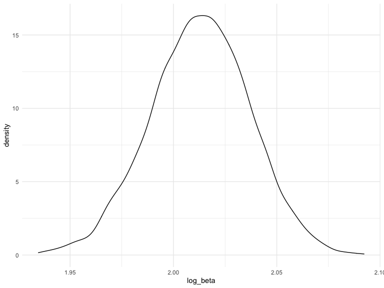

P8105 HW6
================
Jiacheng Wu
12/1/2021

## Problem 1

Read in and tidy data

``` r
birthweight_df = read_csv ("./birthweight.csv") %>% 
  mutate(babysex = factor(recode(babysex, `1` = "male", `2` = "female"))) %>% 
  mutate(mrace = factor(recode(mrace, `1`="White",`2` = "Black", `3` = "Asian", 
                                      `4` ="Putero Rican",`8`="other"))) %>% 
  mutate(frace = factor(recode (frace, `1`="White",`2` = "Black", `3` = "Asian", 
                                      `4` ="Putero Rican",`8`="other", `9` = "Unknown"))) 
```

Propose model

``` r
fit1 = lm(bwt ~ delwt, data = birthweight_df)
```

``` r
birthweight_df %>% 
  select(bwt, delwt) %>% 
  add_predictions(fit1) %>% 
  add_residuals(fit1) %>% 
  ggplot(aes(x = delwt, y = resid)) +
  geom_violin()
```



Compare models using cross validation

``` r
cv_df = 
  crossv_mc(birthweight_df, 100) %>% 
  mutate(
    train = map(train, as_tibble),
    test = map(test, as_tibble)
  ) %>% 
  mutate(
    fit1 = map(train, ~lm(bwt ~ delwt, data = .x)),
    fit2 = map(train, ~lm(bwt ~ blength + gaweeks, data = .x)),
    fit3 = map(train, ~lm(bwt ~ bhead + blength + babysex + bhead*blength + bhead*babysex + blength*babysex + 
                                   bhead*blength*babysex, data = .x))) %>% 
    mutate(
   rmse1 = map2_dbl(fit1, test, ~rmse(model = .x, data = .y)),
   rmse2 = map2_dbl(fit2, test, ~rmse(model = .x, data = .y)),
   rmse3 = map2_dbl(fit3, test, ~rmse(model = .x, data = .y)))
```

Visualizing

``` r
cv_df %>% 
  select(starts_with("rmse")) %>% 
  pivot_longer(
    everything(),
    names_to = "model", 
    values_to = "rmse",
    names_prefix = "rmse_"
  ) %>% 
  ggplot(aes(x = model, y = rmse)) +
  geom_boxplot()
```



Based on the visualization of the three models, we conclude that `fit3`
is the best model as it has the lowest rsme.

## Problem 2

Downloda data

``` r
weather_df = 
  rnoaa::meteo_pull_monitors(
    c("USW00094728"),
    var = c("PRCP", "TMIN", "TMAX"), 
    date_min = "2017-01-01",
    date_max = "2017-12-31") %>%
  mutate(
    name = recode(id, USW00094728 = "CentralPark_NY"),
    tmin = tmin / 10,
    tmax = tmax / 10) %>%
  select(name, id, everything())
```

    ## Registered S3 method overwritten by 'hoardr':
    ##   method           from
    ##   print.cache_info httr

    ## using cached file: ~/Library/Caches/R/noaa_ghcnd/USW00094728.dly

    ## date created (size, mb): 2021-10-09 16:25:09 (7.604)

    ## file min/max dates: 1869-01-01 / 2021-10-31

``` r
boot_sample = function(df) {
  
  sample_frac(df, replace = TRUE)
  
}
```

Bootstraping

``` r
boot_strap_df = 
  tibble(strap_number = 1:5000,
         strap_sample = rerun(5000, boot_sample(weather_df))
         )
```

``` r
rsquare_results = boot_strap_df %>% 
  mutate(
    models = map(strap_sample, ~lm(tmax ~ tmin, data = .x)),
    results = map(models, broom::glance)) %>% 
  select(strap_number, results) %>% 
  unnest(results)

rsquare_results %>% 
  ggplot(aes(x = r.squared)) + geom_density()
```



The distribution of r.squared has a heavy tail extending to low values,
so there could be large outliers are included in the bootstrap sample.

``` r
CI = c(quantile(rsquare_results$r.squared, 0.025), quantile(rsquare_results$r.squared, 0.975))

## The 95% confidence interval is 
CI
```

    ##      2.5%     97.5% 
    ## 0.8945649 0.9271489

``` r
beta_results = boot_strap_df %>% 
  mutate(
    models = map(strap_sample, ~lm(tmax ~ tmin, data = .x) ),
    beta_results = map(models, broom::tidy)) %>% 
  select(strap_number, beta_results) %>% 
  unnest(beta_results) %>% 
  select(strap_number, term, estimate) %>% 
  pivot_wider(names_from = term,
              values_from = estimate) %>% 
  mutate(log_beta = log(`(Intercept)` * tmin))

beta_results %>% 
  ggplot(aes(x = log_beta)) + geom_density()
```



The distribution of log(beta0 \* beta) is approximately normal.

``` r
CI = c(quantile(beta_results$log_beta, 0.025), quantile(beta_results$log_beta, 0.975))

## The 95% confidence interval is 
CI
```

    ##     2.5%    97.5% 
    ## 1.965165 2.059275
